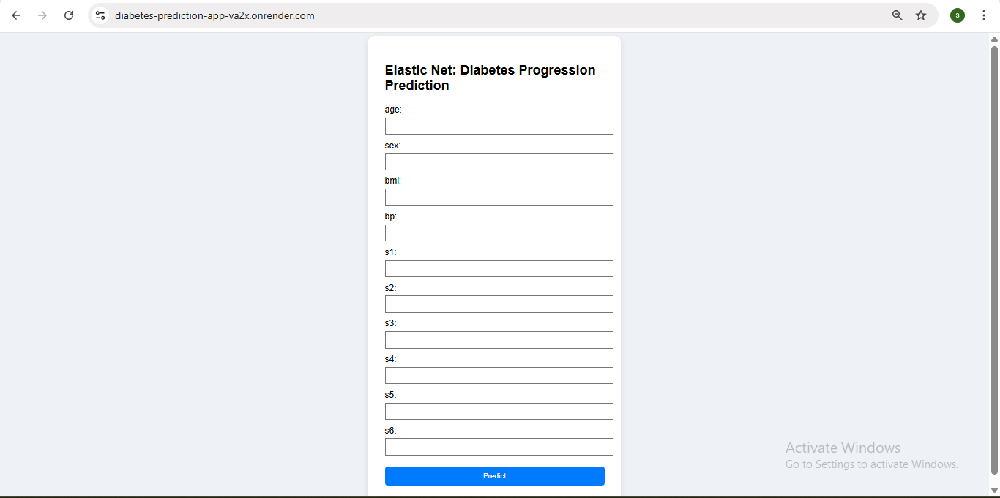
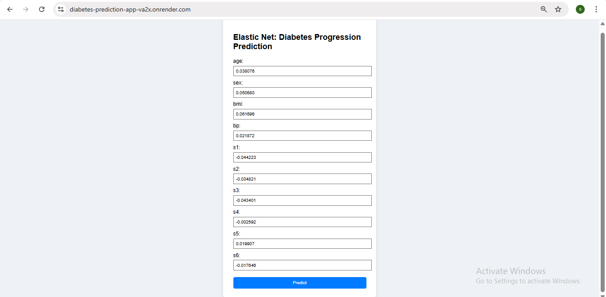
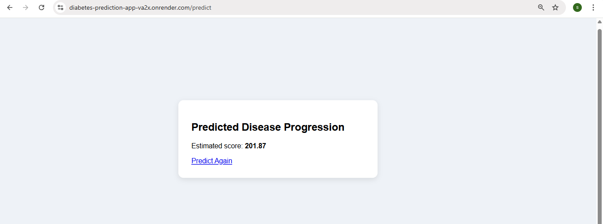

# Diabetes-Prediction-App

This project is a web application that predicts the progression of diabetes in patients using an **Elastic Net Regression model**. The model is trained on the well-known Diabetes dataset from scikit-learn, which includes 10 numeric features such as age, BMI, blood pressure, and blood serum measurements.

---

## Features

- Uses 10 standardized numeric features from the Diabetes dataset.
- Inputs include age, BMI, blood pressure, and serum measurements.
- Handles continuous, normalized data with no missing values.
- Supports Elastic Net’s combined L1 and L2 regularization.
- Designed for predicting disease progression in patients.
  
---

## Prerequisites

Make sure the following are installed:

- Python 3.7 or higher installed
- Git installed and configured
- Basic knowledge of Python and Flask
- A GitHub account (for code hosting)
- Render account (for deployment)

---

## Installation

### 1. Clone the repository

```
git clone https://github.com/sandhiya0147/Diabetes-Prediction-App.git
cd Diabetes-Prediction-App
```

### 2. Install dependencies

```
pip install -r requirements.txt
```

---

## Running the Application

Start the Flask development server:

```
python app.py
```

Then open your browser and go to:

```
http://127.0.0.1:5000
```

---

## How It Works

- The user enters 10 numeric health indicators into a web form.
- Flask collects the inputs and formats them into a structured DataFrame.
- The model pipeline scales the input and applies Elastic Net Regression.
- The trained model predicts the patient’s diabetes progression score.
- The result is displayed on a new page showing the predicted value.
  
---

## File Structure

```
Diabetes-Prediction-App
├── app.py
├── model_train.py
├── model.pkl
├── requirements.txt
├── Procfile
├── README.md
├── templates/
│   ├── home.html
│   └── result.html
├── static/
│   └── style.css     
```

---

## Future Improvements

- Add model evaluation metrics and visualizations (e.g., residual plots).
- Let users compare predictions from Elastic Net, Ridge, and Lasso models.
- Allow CSV upload for bulk prediction of multiple patient records.
- Improve UI with real-time validation and tooltips for input features.
- Connect to a database to log user inputs and predictions for analysis.

---


## Step-by-Step Guide: How to Use the Movie Interest Predictor


### Step 1: Input Form
  

### Step 2: Filled Form 
  

### Step 3: Prediction Result


---

## Live Demo

[Click here to view the deployed app](https://diabetes-prediction-app-va2x.onrender.com)

---
